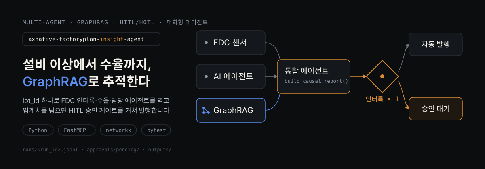
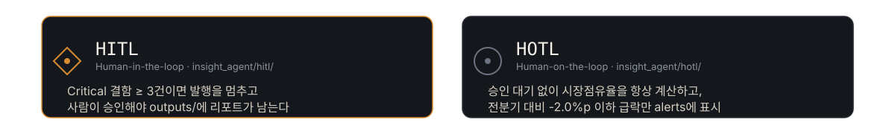

<p align="center">
  
</p>

`dataset_2`(반도체 DS 수율·공정설계 & DX 스마트팩토리 데이터 레이크, 3개년)를 기반으로 만든
멀티에이전트 + 커스텀 MCP + GraphRAG + 하네스 엔지니어링 + HITL/HOTL + 대화형 에이전트
실습 패키지입니다. Claude Code(CLI/Desktop)와 Codex(CLI/Desktop) 양쪽에서 동일하게
동작하도록 만들어졌습니다.

## 핵심 시나리오

"이 웨이퍼 로트(lot_id)의 챔버 설비(FDC) 이상이 수율 하락의 원인이고, 어떤 AI
에이전트가 관여했는가?"를 `lot_id` 하나로 추적해, FDC 인터록이 임계치 이상
발생한 경우에만 사람 승인을 거쳐 리포트를 발행합니다. 여기에 GraphRAG 지식
그래프(로트-공정-챔버-AI에이전트-결함 관계)를 얹어, 팩트 테이블 조인만으로는
안 보이는 관계형 질문("이 에이전트가 제어하는 다른 챔버는?")에도 답합니다.

## 빠른 시작

```bash
cd /path/to/electronics-insight-agent
pip install -r requirements.txt

# 자동 발행 경로 (FDC 인터록 0건 -> 임계치 미만)
python -m insight_agent.scripts.run_pipeline --lot-id LOT-2309-50001

# HITL 승인 대기 경로 (FDC 인터록 2건 -> 임계치 이상, 승인 큐로 이동)
python -m insight_agent.scripts.run_pipeline --lot-id LOT-2503-50790
```

내부적으로 (1) CSV/xlsx 소스 정합성 검사 -> (2) 통합 에이전트가 MCP 서버에
`build_causal_report` 호출 -> (3) GraphRAG로 관련 서브그래프 조회 -> (4) 가드레일
검증(리포트 스키마 + 그래프 결과 스키마) -> (5) HITL 게이트 판단(FDC 인터록
1건 이상이면 승인 대기, 아니면 자동 발행) -> (6) HOTL 스냅샷 생성 순서로
동작하며, `runs/<run_id>.jsonl`에 전체 트레이스가 남습니다.

## 대화형 에이전트 + 멀티에이전트 파이프라인 시각화

```bash
python -m insight_agent.fe.server
# -> http://127.0.0.1:8899  (기본 탭: "대화형 분석")
```

<p align="center">
  
</p>

FE를 열면 왼쪽엔 채팅 창, 오른쪽엔 그 턴이 실제로 어떤 에이전트/툴/게이트를
거쳤는지 실시간으로 밝혀지는 파이프라인 패널이 나란히 뜹니다(요청하신 "별도의
레이아웃"). 별도 SSE/WebSocket 없이, harness의 `TraceLogger`가 이미 남기는
`runs/<run_id>.jsonl`을 FE가 폴링해서 애니메이션으로 그립니다 -- 대화 한 턴은
서버가 백그라운드 스레드에서 처리하고(MCP 서브프로세스 호출이 몇 초 걸리므로),
그 사이 FE가 트레이스를 폴링해 여섯 단계(오케스트레이터 -> GraphRAG 리트리버 ->
도메인 에이전트 -> 리포트 가드레일 -> HITL 게이트 -> 응답 합성)를 순서대로
밝힙니다. 리포트 가드레일/HITL 게이트는 통합(인과) 리포트 경로에서만 실제로
발생하므로, FDC/수율/KPI/그래프 단순 조회 질의에서는 의도적으로 pending으로
남습니다.

입력창 위에는 항상 예상 질문 칩이 떠 있고, 각 턴이 끝나면 방금 응답의
GraphRAG 서브그래프(에이전트/공정/챔버/결함 노드)를 기반으로 후속 질문이
다시 채워집니다. 칩을 눌러가며 대화를 원하는 만큼 이어가다가, 채팅 헤더의
**"리포트 저장 (.md)"** 버튼을 누르면 그 시점까지의 대화 전체가
`outputs/chat_report_<session_id>.md`로 저장되고 "대화 리포트" 탭에서
마크다운으로 렌더링되어 바로 눈으로 확인할 수 있습니다
(ANTHROPIC_API_KEY/OPENAI_API_KEY가 있으면 LLM이 요약해 작성하고, 없으면
결정론적 템플릿 + 전체 대화 기록 부록으로 대체됩니다 -- 키 없이도 항상
끝까지 동작한다는 이 프로젝트의 원래 설계를 그대로 따릅니다).

**중요:** 이 리포트는 AI PRD가 아니고, 턴 수에 따라 자동으로 생성되지도
않습니다. AI PRD는 이 대화형 분석이 끝난 뒤 사용자가 이 리포트를 참고해
**직접, 별도로** 작성하는 문서입니다(`docs/prd.md`의 Day 1 실습과 같은
성격). 저장 버튼/리포트 형식은 실습 목적에 맞게 교육생이 자유롭게 고쳐도
되는 지점으로 남겨뒀습니다(`insight_agent/chat/report.py`).

기존 4개 탭(PRD(Day1)/트레이스/승인 큐(HITL)/HOTL 모니터)도 그대로 남아 있고,
상단의 로트 선택 + "분석 실행" 버튼으로 레거시 단건 실행도 가능합니다.

## GraphRAG (지식 그래프)

`insight_agent/graph/`가 `domain.py`의 스타 스키마를 결정론적으로 그래프로
재구성합니다(임베딩/외부 인덱싱 없음 -- `networkx` 하나로 충분한 규모).

- **노드**: 로트(1,500) / 공정(8) / 챔버(8) / AI에이전트(5) / 데이터레이크
  계층(5) / 결함 유형(4)
- **엣지**: `processed_by`(로트-공정) / `processed_in`(로트-챔버) /
  `controlled_by`(챔버-에이전트) / `designed_for`(공정-챔버) /
  `exhibits`(로트-결함) / `interlock_event`(인터록 발생)
- **리트리벌**: 질의에서 알려진 ID(`LOT-…`/`PRC-…`/`AGT-…` 등)나 이름을
  문자열 매칭으로 찾아 시드로 삼고, k-hop 이웃을 확장한다 -- 전형적인
  GraphRAG의 local search 경로. 허브 노드(공정/챔버 하나에 수백 개 로트가
  물린 경우)가 예산을 독점하지 않도록 타입별로 캡을 건다
  (`insight_agent/graph/retriever.py`의 `khop_subgraph`).

MCP 툴 `graph_query(query, hops)` / `graph_stats()`로 노출되고, `graph_agent`가
`harness.loop.run_with_retry` + `harness.trace` + `harness.guardrails.
validate_graph_result`로 감싸 호출합니다 -- **GraphRAG(그래프 엔지니어링)가
독립된 부가 기능이 아니라 하네스 엔지니어링과 같은 신뢰 경계 안에서 동작**
하도록 만든 지점입니다. 통합 에이전트(`integration_agent`)는 이 서브그래프를
리포트에 `graph_context`로 함께 실어, 승인자가 팩트 테이블만으로는 안 보이는
관계까지 보고 판단할 수 있게 합니다.

## HITL vs HOTL

- **HITL** (`insight_agent/hitl/`): 통합 에이전트가 만든 리포트에서 FDC
  인터록이 `FDC_INTERLOCK_HITL_THRESHOLD`(기본 1건) 이상이면 자동 발행을
  멈추고 `approvals/pending/`에 대기시킵니다. 사람이 승인해야 `outputs/`에
  최종 리포트가 생성됩니다.
- **HOTL** (`insight_agent/hotl/`): 승인 대기 없이 항상 계산·노출되는 공정
  노드별 다이 수율(`die_yield_pct`) 스냅샷입니다. 전분기 대비
  `DIE_YIELD_DROP_ALERT_PP`(기본 -0.5%p) 이하로 하락한 공정 노드만 `alerts`에
  표시되고, 사람은 필요할 때만 개입합니다.

## 데이터

기본 경로는 `~/Desktop/dataset_2`(실행 사용자의 홈 디렉토리 기준)이며,
환경변수로 바꿀 수 있습니다.

```bash
export DATASET_DIR=/path/to/other/dataset
```

| 테이블 (파일) | 종류 | PK | 설명 |
|---|---|---|---|
| `dim_process_design` | 차원 | `process_id` | EUV 노광/ALE 식각/ALD 증착 등 공정 설계 |
| `dim_ai_automation_role` | 차원 | `agent_id` | VM/FDC/APC 등 제조 AI 에이전트 역할 |
| `dim_semicon_dx_architecture` | 차원 | `data_lake_id` | Bronze/Silver/Gold 데이터 레이크 레이어 |
| `fact_wafer_lot_yield` | 팩트 | `lot_id` | 로트별 투입/양품/수율/결함 유형 |
| `fact_fdc_chamber_sensor` | 팩트 | `fdc_log_id` | 챔버 FDC 센서 시계열 (`lot_id`, `process_id`로 연계) |
| `fact_dx_smart_factory_kpi` | 팩트 | `kpi_month_id` | 월별 DX 스마트팩토리 운영 성과 |

## 구조

```
insight_agent/
  config.py          # 경로/임계치 설정
  domain.py           # 데이터 접근·조인 로직 (스키마 지식은 전부 여기에)
  mymcp/              # FastMCP 기반 MCP 서버/클라이언트 (로컬 stdio 전송)
    server.py           # 6개 툴: FDC/수율/KPI/통합/그래프조회/그래프통계
    client.py
  graph/              # GraphRAG: 지식 그래프 빌더 + k-hop 리트리버
    builder.py
    retriever.py
  agents/             # 도메인 기반 5분할: FDC/수율/KPI/그래프/통합(인과)
    fdc_agent.py
    yield_agent.py
    kpi_agent.py
    graph_agent.py
    integration_agent.py
    orchestrator.py     # 키워드+lot_id 패턴 기반 라우팅
    llm.py               # Anthropic/OpenAI 프로바이더 추상화 (키 없으면 미사용)
    narrative.py
  harness/
    trace.py            # JSONL 트레이스 로깅
    loop.py             # 재시도 루프
    guardrails.py        # 리포트/그래프 결과 스키마 검증 + CSV/xlsx 정합성 검증
  chat/               # 대화형 에이전트 오케스트레이션 (신규)
    engine.py            # 한 턴 처리: GraphRAG 증강 -> 도메인 라우팅 -> 응답 합성
    store.py             # 세션 파일 저장 (runs/chat/<session_id>.json)
    suggestions.py        # 예상 질문(시드 + 턴별 후속 질문)
    report.py             # 대화 기록 -> 분석 리포트(.md) 수동 생성 (자동 트리거 없음)
  hitl/
    approvals.py         # 파일 기반 승인 큐 (pending/approved/rejected)
    cli.py
  hotl/
    monitor.py            # 공정 노드별 다이 수율 상시 스냅샷 + 급락 알림
  evals/
    build_golden_set.py
    run_eval.py
  scripts/
    run_pipeline.py       # 엔드투엔드 데모 진입점
  fe/
    server.py              # stdlib http.server 백엔드 (채팅/파이프라인/대화 리포트 API 포함)
    static/                 # 바닐라 JS SPA (6개 탭)
```

## 더 알아보기

### HITL 승인 큐 확인/처리

```bash
python -m insight_agent.hitl.cli list
python -m insight_agent.hitl.cli approve appr-xxxxxxxx
python -m insight_agent.hitl.cli reject appr-xxxxxxxx --reason "원인 재확인 필요"
```

### MCP 서버 단독 실행

```bash
python -m insight_agent.mymcp.server
```

### Claude Code (CLI/Desktop) 연동

저장소 루트의 [.mcp.json](.mcp.json)에 프로젝트 스코프로 이미 등록되어 있습니다.
`${CLAUDE_PROJECT_DIR}`를 사용하므로 절대경로 수정 없이, 이 저장소를 클론해서
Claude Code(CLI/Desktop)로 열기만 하면 자동으로 인식됩니다. 최초 1회 프로젝트
MCP 서버 승인 프롬프트만 확인하면 이후 계속 활성화된 상태로 유지됩니다.
`AGENTS.md`의 레이어 경계/체크리스트를 그대로 따릅니다.

### Codex (CLI/Desktop) 연동

Codex는 Claude Code의 `.mcp.json` 같은 프로젝트 스코프 자동 등록 파일이 없어
전역 설정에 직접 등록해야 합니다. [codex/config.toml](codex/config.toml)의
`[mcp_servers.electronics-insight]` 테이블을 `~/.codex/config.toml`에 병합하고
`<PROJECT_DIR>`를 이 저장소의 절대 경로로 바꾼 뒤 Codex를 재시작하세요.
`AGENTS.md`는 Codex CLI가 리포지토리를 열 때 자동으로 읽으므로 별도 설정이
필요 없습니다 -- 레이어 경계 규칙이 Claude Code와 동일하게 적용됩니다.

### LLM 프로바이더 (선택)

대화형 에이전트의 응답 합성/대화 리포트 작성/통합 리포트 서술 요약은 다음
순서로 자동 선택됩니다 (`insight_agent/agents/llm.py`):

```bash
export ANTHROPIC_API_KEY=...   # Claude Code 환경이면 이쪽을 우선 사용
# 또는
export OPENAI_API_KEY=...      # Codex/OpenAI 환경이면 이쪽을 사용
```

둘 다 없으면 결정론적 템플릿으로 대체됩니다 -- 이 프로젝트는 키가 없어도
항상 끝까지 동작해야 한다는 원래 설계를 그대로 지킵니다.

### 골든셋 이밸류에이션

```bash
python -m insight_agent.evals.build_golden_set   # 최초 1회, golden_defects.jsonl 생성
python -m insight_agent.evals.run_eval           # 통과율 출력, 미달 시 non-zero exit
```

### 테스트

```bash
pytest -v
```

## 참고 문서

- `docs/prd.md`은 이 repo에 포함하지 않습니다 — Day 1(데이터 분석 -> PRD 작성)
  실습으로 각자 직접 작성하는 문서이기 때문입니다. 대화형 에이전트의
  "리포트 저장" 버튼으로 만드는 `outputs/chat_report_*.md`("대화 리포트" 탭)는
  이 PRD 작성 실습에 참고 자료로 쓰라고 만든 것이며, PRD 자체를 대신하지
  않습니다 — 자동으로 생성되지도 않습니다(사용자가 버튼을 눌러야만 만들어짐).
- [docs/TOKEN_OPTIMIZATION.md](docs/TOKEN_OPTIMIZATION.md) — Claude Code 토큰 최적화 가이드

## 다음 단계 (이 MVP 이후)

1. `chat/engine.py`의 도메인별 인자 추출(kwargs 빌더)을 실제 NLU/함수 호출
   스키마로 고도화
2. 리전별/공장별 접근 권한 분리 (지금은 모든 사용자가 전체 데이터를 조회 가능)
3. GraphRAG 리트리버에 커뮤니티 탐지/PageRank 같은 global search 경로 추가
